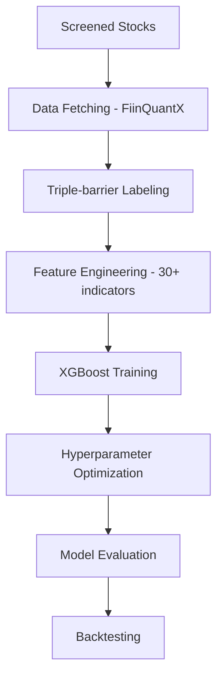
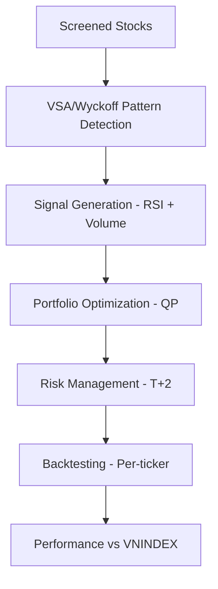

# Stock Signal Classification System

**Đội thi DataStorm**

| Thành viên | SBD | Email | Trường |
|------------|-------|-------|---------|
| Nguyễn Dương | B0261 | duongnguyen4823@gmail.com | Trường Đại học Công nghệ thông tin, ĐHQG TP.HCM |
| Nguyễn Hữu Kiên | B0118 | kiennh22414@st.uel.edu.vn | Trường Đại học Kinh tế - Luật, ĐHQG TP. HCM |
| Phan Nguyễn Tường Vy | B0111 | phannguyentuongvy972004@gmail.com | Trường Đại học Tôn Đức Thắng |


---

Hệ thống phân loại tín hiệu giao dịch chứng khoán với **2 approach chính**:

## 🎯 2 kỹ thuật giao dịch

### 1. **ML-based Trading System** 
- **Event-driven Labeling**: Triple-barrier method với volatility scaling
- **Technical Indicators**: 30+ chỉ báo từ FiinQuantX (EMA, RSI, MACD, ATR, etc.)
- **XGBoost Model**: Với hyperparameter optimization và time-series CV
- **Automated Pipeline**: Từ raw data đến trained model
- **Comprehensive Backtesting**: Đánh giá hiệu suất với VN-Index benchmark

### 2. **Rule-based TA System** 
- **VSA/Wyckoff Patterns**: Volume Spread Analysis với 8 pattern chính
- **Portfolio Optimization**: Quadratic programming với ràng buộc risk-return
- **Multi-timeframe Analysis**: Tín hiệu từ daily data với T+2 constraints
- **Dynamic Rebalancing**: Tối ưu trọng số danh mục theo market regime

## 🚀 Khởi chạy nhanh

```bash
# Cài đặt dependencies
pip install -r requirements.txt

# Thiết lập credentials
cp env.example .env
# Edit .env file với credentials thực

# Chạy ML-based pipeline
python main.py

# Chạy backtesting (sau khi train model)
python backtest.py

# Chạy custom backtest với rule-based
python run_custom_backtest.py
```

## 📊 Cấu trúc dự án

```
stock-quant/
├── config/           # Cấu hình YAML
│   ├── data_config.yaml        # ML data & features
│   ├── labeling_config.yaml    # Triple-barrier config
│   └── model_config.yaml       # XGBoost config
├── src/              # ML-based system
│   ├── data/         # Data processing
│   ├── models/       # XGBoost trainer
│   ├── backtesting/  # Backtest engine
│   └── pipeline/     # End-to-end pipelines
├── notebooks/        # Rule-based & Screening
│   ├── Code/
│   │   ├── Filter_stock.ipynb      # Stock screening
│   │   └── Final_Algorithms.ipynb  # VSA/Wyckoff TA
│   └── Data/         # Historical data
├── data/             # Datasets (raw/processed/final)
├── models/           # Trained models 
├── results/          # Training & backtest results
└── main.py           # Entry point
```

## 🔄 Workflow tổng thể
### ML-based Trading


### Rule-based Trading


## 🛠️ Tài liệu tham khảo

- **[SETUP.md](SETUP.md)**: Hướng dẫn setup nhanh cho người mới
- **[DOCUMENTATION.md](DOCUMENTATION.md)**: Chi tiết kỹ thuật ML pipeline
- **[Q&A.md](Q&A.md)**: Hỏi đáp chi tiết về hệ thống và troubleshooting
- **[BACKTEST_GUIDE.md](BACKTEST_GUIDE.md)**: Hướng dẫn backtesting và đánh giá hiệu suất

## 🔧 Cấu hình nâng cao

### ML System
Chỉnh sửa `config/` files:
- `data_config.yaml`: Tickers, timeframes, indicators
- `labeling_config.yaml`: Triple-barrier parameters
- `model_config.yaml`: XGBoost hyperparameters

### Rule-based System
Chỉnh sửa trong notebooks:
- VSA pattern thresholds
- Portfolio optimization constraints
- Risk management rules

