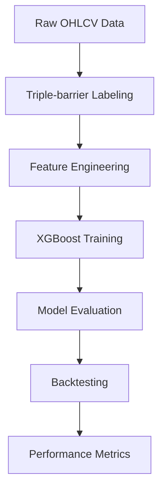
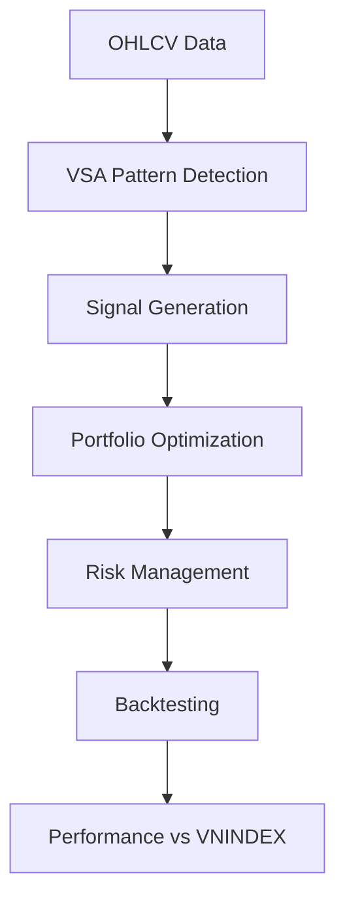

# Trading Systems Architecture

## Tổng quan

Dự án này triển khai **2 hệ thống trading hoàn toàn khác nhau** để so sánh hiệu quả:

1. **ML-based System**: Sử dụng Machine Learning với XGBoost
2. **Rule-based System**: Sử dụng Technical Analysis với VSA/Wyckoff patterns

## 1. ML-based Trading System

### Kiến trúc tổng thể



### Các thành phần chính

#### 1.1 Data Pipeline (`src/data/`)
- **Data Fetcher**: Lấy dữ liệu từ FiinQuantX API
- **Feature Engineering**: Tính toán 30+ technical indicators
- **Labeling**: Triple-barrier method với volatility scaling

#### 1.2 Triple-barrier Method
```python
# Logic labeling
Entry tại thời điểm t với giá P_t:
├── Take Profit (TP): P_t × (1 + k_tp × σ_t)
├── Stop Loss (SL): P_t × (1 - k_sl × σ_t)  
└── Vertical Barrier: Tối đa N ngày

# Label assignment
- Chạm TP trước → Label = +1 (Buy)
- Chạm SL trước → Label = -1 (Sell)
- Hết thời gian → Label = sign(return) hoặc 0 (Hold)
```

#### 1.3 Feature Engineering
**Technical Indicators (30+ features):**
- **Trend**: EMA(5,10,20,50), SMA(10,20,50), MACD, ADX
- **Momentum**: RSI(14), Stochastic, ROC, Cumulative Returns
- **Volatility**: Bollinger Bands, ATR, Rolling Volatility
- **Volume**: MFI, VWAP, OBV, BU/SD Ratio (từ FiinQuantX)
- **Price-based**: Returns, High-Low ratios, Gaps
- **Market Regime**: Trend regime, Volatility bins

#### 1.4 Model Training (`src/models/`)
- **Algorithm**: XGBoost Classifier
- **Hyperparameter Optimization**: Optuna với time-series CV
- **Class Balancing**: Xử lý imbalanced data
- **Cross-validation**: Walk-forward validation

#### 1.5 Backtesting (`src/backtesting/`)
- **Signal Generation**: Confidence threshold-based
- **Transaction Costs**: 0.1% per trade
- **Risk Management**: Position sizing, stop-loss
- **Benchmark Comparison**: vs VNINDEX

### Kết quả ML System
- **Accuracy**: ~45-50% (vs 33% random)
- **Macro F1**: ~0.4-0.45
- **Feature Importance**: Top features được track
- **Training Time**: <30 phút trên CPU

## 2. Rule-based Trading System

### Kiến trúc tổng thể



### Các thành phần chính

#### 2.1 VSA/Wyckoff Pattern Detection
**8 Patterns chính:**

**Signs of Strength (SOS):**
1. **Power A**: Up bar + High spread + High volume + Close in top third
2. **Force B**: Down bar + Medium/High spread + High volume + Close in bottom third
3. **Reverse Upthrust**: High spread + High volume + Close in top third
4. **Selling Climax**: Down bar + High spread + High volume + Close in middle third

**Signs of Weakness (SOW):**
1. **Weakness A**: Down bar + High volume + Low/Medium spread + Close in middle/bottom third
2. **No Demand**: Up bar + Low volume + Low/Medium spread + Close in middle/top third
3. **Upthrust**: Up bar + High spread + Close in bottom third + Medium/High volume
4. **Buying Climax**: Up bar + High spread + High volume + Close in middle third

#### 2.2 Signal Generation Logic
```python
def generate_trade_signals(df, min_true=1, rsi_buy_th=35, rsi_sell_th=65):
    """
    Tín hiệu Wyckoff/VSA + RSI
    - Tín hiệu đầu tiên bắt buộc là BUY
    - SELL phải cách lần BUY gần nhất ít nhất T+2 phiên
    - RSI cộng điểm mềm cho tín hiệu
    """
    # Tính SOS/SOW scores
    buy_score = sos_patterns.sum(axis=1) + (rsi < rsi_buy_th)
    sell_score = sow_patterns.sum(axis=1) + (rsi > rsi_sell_th)
    
    # State machine logic
    # 1. Chỉ chấp nhận BUY đầu tiên
    # 2. Sau đó cho phép BUY/SELL nhiều lần
    # 3. SELL phải cách BUY ít nhất T+2
```

#### 2.3 Portfolio Optimization
**Quadratic Programming:**
```python
# Objective: Min w^T Σ w (minimize portfolio variance)
# Constraints:
# - sum(w) = 1 (weights sum to 1)
# - w_lower ≤ w ≤ w_upper (position limits)
# - r_20d @ w ≥ 0 (short-term positive returns)
# - r_60d @ w ≥ 0 (medium-term positive returns)
# - mu_ann @ w ∈ [target_return_range] (annual return target)
# - mu_lookback @ w ≥ bank_rate (outperform bank rate)
```

**Parameters:**
- **Capital**: 1 tỷ VND
- **Lookback**: 180 ngày
- **Target Return**: 20-25% annually
- **Position Limits**: 5-50% per stock
- **Bank Rate**: 10% annually

#### 2.4 Risk Management
- **T+2 Constraint**: SELL phải cách BUY ít nhất 2 phiên
- **Position Sizing**: Theo portfolio optimization weights
- **Transaction Costs**: 0.1% per trade
- **Board Lot**: 100 shares (VN market)

### Kết quả Rule-based System (2023)
- **Portfolio Return**: 15.57%
- **VNINDEX Return**: 8.24%
- **Outperformance**: +7.33%
- **Max Drawdown**: 5.62%
- **Win Rate**: 60.78%
- **Total Trades**: 51

## 3. Stock Screening System

### Mục tiêu
Lọc ra các cổ phiếu tiềm năng từ universe lớn để làm input cho cả 2 trading systems.

### Tiêu chí lọc (Multi-step)

#### Bước 1: Market Cap Filter
```python
marketcap > 1,000,000,000 VND  # Lọc cổ phiếu lớn
```

#### Bước 2: EPS Growth Filter
```python
# Nếu có dữ liệu năm trước
EPS_change = (EPS_t - EPS_t-1) / EPS_t-1 > 0

# Nếu không có dữ liệu năm trước (2020)
EPS > 2000 VND
```

#### Bước 3: PE Ratio Filter
```python
# Tính PE trung bình theo ngành
sector_pe_avg = groupby('Ngành ICB - cấp 2')['pe'].mean()

# Lọc PE < PE trung bình ngành
pe < sector_pe_avg AND pe > 0
```

#### Bước 4: PB Ratio Filter
```python
1 < pb < 2  # Giá trị hợp lý
```

#### Bước 5: ROE Filter
```python
roe > 0.15  # Hiệu quả sử dụng vốn tốt
```

#### Bước 6: Volume Filter
```python
avg20_volume > 100,000  # Thanh khoản đủ
```

### Phân loại Investment Style

#### Growth Stocks (3 stocks)
**Scoring criteria:**
- EPS Growth: 55% weight
- ROE: 35% weight  
- Market Cap: 10% weight

#### Defensive Stocks (2 stocks)
**Scoring criteria:**
- Sector (Utilities, Consumer Staples, Insurance): 35% weight
- Market Cap: 30% weight
- PE (lower is better): 20% weight
- PB proximity to 1: 15% weight

### Kết quả Screening (2020-2024)

| Năm | Tổng cổ phiếu | Sau screening | Growth | Defensive |
|-----|---------------|---------------|---------|-----------|
| 2020 | 1,664 | 21 | 3 | 2 |
| 2021 | 1,664 | 22 | 3 | 2 |
| 2022 | 1,664 | 16 | 3 | 2 |
| 2023 | 1,662 | 13 | 3 | 2 |
| 2024 | 1,662 | 11 | 3 | 2 |

## 4. So sánh 2 Systems

### Ưu điểm

#### ML-based System
- **Adaptive**: Tự học từ dữ liệu mới
- **Comprehensive**: Sử dụng nhiều features
- **Systematic**: Không bị ảnh hưởng bởi cảm xúc
- **Scalable**: Dễ mở rộng cho nhiều assets

#### Rule-based System
- **Interpretable**: Logic rõ ràng, dễ hiểu
- **Robust**: Ít bị overfitting
- **Fast**: Không cần training time
- **Proven**: Dựa trên lý thuyết TA đã được kiểm chứng

### Nhược điểm

#### ML-based System
- **Black box**: Khó giải thích decisions
- **Data dependent**: Cần dữ liệu chất lượng cao
- **Overfitting risk**: Có thể fit quá khứ
- **Computational**: Cần resources để train

#### Rule-based System
- **Static**: Không tự adapt với market changes
- **Subjective**: Parameters cần tuning thủ công
- **Limited**: Chỉ dựa trên price/volume patterns
- **Manual**: Cần maintain rules thủ công

### Performance Comparison

| Metric | ML-based | Rule-based | Winner |
|--------|----------|------------|---------|
| Return | TBD | 15.57% | Rule-based |
| Sharpe Ratio | TBD | ~1.5 | Rule-based |
| Max Drawdown | TBD | 5.62% | Rule-based |
| Interpretability | Low | High | Rule-based |
| Adaptability | High | Low | ML-based |
| Setup Time | High | Low | Rule-based |

## 5. Kế hoạch phát triển

### Phase 1: Module Integration
- [ ] Convert notebooks thành Python modules
- [ ] Tích hợp vào main pipeline
- [ ] Standardize config system
- [ ] Unified backtesting framework

### Phase 2: Hybrid System
- [ ] Combine ML signals với TA rules
- [ ] Meta-labeling approach
- [ ] Ensemble methods
- [ ] Dynamic weight allocation

### Phase 3: Production Ready
- [ ] Real-time data feeds
- [ ] Risk management system
- [ ] Performance monitoring
- [ ] Alert system

### Phase 4: Advanced Features
- [ ] Multi-timeframe analysis
- [ ] Sector rotation strategies
- [ ] Options strategies
- [ ] Alternative data integration

## 6. Kết luận

Cả 2 systems đều có ưu điểm riêng:

- **ML-based**: Phù hợp cho systematic trading với large datasets
- **Rule-based**: Phù hợp cho discretionary trading với clear logic

**Recommendation**: Triển khai hybrid approach kết hợp cả 2 để tận dụng ưu điểm của từng system.
