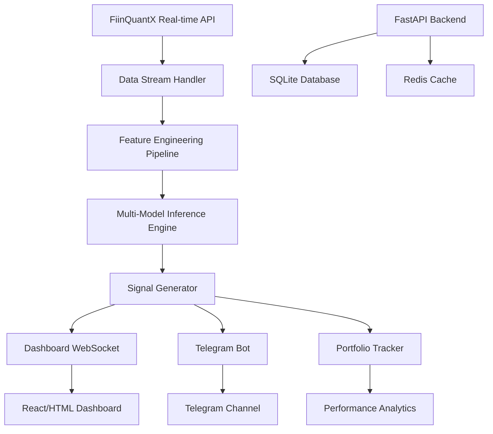

# 🚀 Production Deployment Plan - Real-time Trading Signals Dashboard

## 📋 Tổng quan hệ thống

### 🎯 Mục tiêu
Triển khai model 15m vào production với:
- **Real-time data streaming** từ FiinQuantX 
- **Multi-strategy backtesting** với các confidence/holding period khác nhau
- **Interactive dashboard** hiển thị signals và performance
- **Telegram integration** để gửi alerts
- **Live trading simulation** với portfolio tracking

### 🏗️ Architecture Overview



## 🎛️ Dashboard Features & Layout

### 📊 Main Dashboard Components

#### 1. **Live Market Overview**
```
┌─────────────────────────────────────────────────────────┐
│ 🔴 LIVE MARKET STATUS | 09:15:30 | Session: Morning      │
├─────────────────────────────────────────────────────────┤
│ VN-Index: 1,285.4 (+0.85%) | VN30: 1,321.2 (+1.2%)     │
│ Active Tickers: 9/9 | Last Update: 2s ago               │
└─────────────────────────────────────────────────────────┘
```

#### 2. **Multi-Strategy Performance Grid**
```
┌────────────────────────────────────────────────────────────────┐
│                    STRATEGY PERFORMANCE MATRIX                │
├──────────────┬──────────────┬──────────────┬──────────────────┤
│ Confidence   │ Hold (36bar) │ Hold (72bar) │ Status          │
├──────────────┼──────────────┼──────────────┼──────────────────┤
│ 0.7 🔥       │ 3098.18%     │ 3763.83% ⭐  │ ✅ Active       │
│ 0.6          │ 2541.22%     │ 3012.45%     │ ✅ Active       │
│ 0.5          │ 2145.67%     │ 2678.91%     │ ✅ Active       │
│ 0.4          │ 3098.18%     │ 2234.56%     │ ✅ Active       │
└──────────────┴──────────────┴──────────────┴──────────────────┘
```

#### 3. **Live Signals Feed**
```
┌─────────────────────────────────────────────────────────┐
│                    🎯 LIVE SIGNALS                      │
├─────────────────────────────────────────────────────────┤
│ 09:15:45 | VCB | 🟢 BUY  | Conf: 0.73 | Strategy: 0.7/72│
│ 09:15:30 | HPG | 🔴 SELL | Conf: 0.68 | Strategy: 0.6/36│
│ 09:15:15 | CTG | 🔵 HOLD | Conf: 0.55 | All Strategies  │
├─────────────────────────────────────────────────────────┤
│ 📊 Today: 12 signals | ✅ 8 profitable | 💎 67% win rate│
└─────────────────────────────────────────────────────────┘
```

#### 4. **Real-time Charts & Analysis**
- **Price Chart**: Real-time 15m candlestick với signals overlay
- **Signal Confidence Heatmap**: Ma trận confidence vs time
- **Portfolio P&L**: Real-time portfolio performance tracking
- **Risk Metrics**: Drawdown, Sharpe ratio real-time

#### 5. **Strategy Comparison Panel**
```
┌─────────────────────────────────────────────────────────┐
│           📈 STRATEGY COMPARISON (Last 24H)             │
├──────────────┬─────────────┬─────────────┬─────────────┤
│ Strategy     │ Total P&L   │ Win Rate    │ Trades      │
├──────────────┼─────────────┼─────────────┼─────────────┤
│ 0.7/72 ⭐    │ +2.45%      │ 68.2%       │ 15          │
│ 0.6/36       │ +1.89%      │ 65.4%       │ 23          │
│ 0.4/36       │ +1.67%      │ 64.1%       │ 31          │
└──────────────┴─────────────┴─────────────┴─────────────┘
```

## 🔧 Technical Implementation

### 🏗️ Backend Architecture (FastAPI)

#### 1. **Core Modules**
```python
app/
├── main.py                 # FastAPI app entry point
├── config/
│   ├── settings.py         # App configuration
│   └── strategies.yaml     # Strategy configurations
├── core/
│   ├── data_stream.py      # FiinQuantX real-time handler
│   ├── feature_engine.py   # Real-time feature engineering
│   ├── model_engine.py     # Multi-model inference
│   ├── signal_engine.py    # Signal generation & filtering
│   └── portfolio.py        # Portfolio tracking
├── api/
│   ├── websocket.py        # WebSocket handlers
│   ├── strategies.py       # Strategy management API
│   ├── signals.py          # Signal history API
│   └── portfolio.py        # Portfolio API
├── models/
│   ├── signal.py           # Signal data models
│   ├── portfolio.py        # Portfolio data models
│   └── strategy.py         # Strategy configuration models
├── services/
│   ├── telegram_bot.py     # Telegram integration
│   ├── database.py         # SQLite operations
│   └── redis_cache.py      # Redis caching
└── static/
    ├── js/                 # JavaScript files
    ├── css/                # CSS styles
    └── templates/          # Jinja2 templates
```

#### 2. **Key Classes & Services**

```python
class RealTimeSignalEngine:
    """Core engine for real-time signal generation"""
    def __init__(self):
        self.strategies = load_strategies()  # Multiple confidence/holding configs
        self.models = load_models()          # Pre-trained models
        self.feature_engine = FeatureEngine()
        self.telegram_bot = TelegramBot()
    
    async def process_realtime_bar(self, bar_data):
        # 1. Feature engineering for latest bar
        # 2. Run inference on all strategies
        # 3. Generate signals
        # 4. Send to dashboard via WebSocket
        # 5. Send high-confidence signals to Telegram

class MultiStrategyManager:
    """Manages multiple strategies simultaneously"""
    strategies = {
        "aggressive": {"confidence": 0.4, "holding_bars": 36},
        "balanced": {"confidence": 0.6, "holding_bars": 36}, 
        "conservative": {"confidence": 0.7, "holding_bars": 72},
        "ultra_conservative": {"confidence": 0.8, "holding_bars": 72}
    }

class PortfolioTracker:
    """Real-time portfolio simulation"""
    def track_signals(self, signals):
        # Simulate trades based on signals
        # Calculate P&L, drawdown, win rate
        # Update dashboard metrics
```

### 🎨 Frontend Design (HTML/CSS/JS + Jinja2)

#### 1. **Dashboard Layout**
```html
<!DOCTYPE html>
<html>
<head>
    <title>🚀 Real-time Trading Signals</title>
    <link rel="stylesheet" href="/static/css/dashboard.css">
    <script src="/static/js/websocket.js"></script>
    <script src="/static/js/charts.js"></script>
</head>
<body>
    <div class="dashboard-grid">
        <!-- Market Status Header -->
        <div class="market-status">{{ market_status }}</div>
        
        <!-- Strategy Performance Matrix -->
        <div class="strategy-matrix">{{ strategy_grid }}</div>
        
        <!-- Live Signals Feed -->
        <div class="signals-feed" id="signals-container"></div>
        
        <!-- Real-time Chart -->
        <div class="chart-container">
            <canvas id="price-chart"></canvas>
        </div>
        
        <!-- Portfolio Panel -->
        <div class="portfolio-panel">{{ portfolio_stats }}</div>
    </div>
</body>
</html>
```

#### 2. **CSS Design System**
```css
/* Modern dark theme with trading colors */
:root {
    --bg-primary: #0D1117;
    --bg-secondary: #161B22;
    --text-primary: #F0F6FC;
    --text-secondary: #8B949E;
    --green: #238636;      /* Buy signals */
    --red: #DA3633;        /* Sell signals */
    --blue: #1F6FEB;       /* Hold signals */
    --gold: #FFD700;       /* Best strategy */
}

.dashboard-grid {
    display: grid;
    grid-template-columns: 1fr 1fr 1fr;
    grid-template-rows: auto auto 1fr;
    gap: 20px;
    padding: 20px;
    background: var(--bg-primary);
    color: var(--text-primary);
}
```

#### 3. **Real-time Updates (WebSocket)**
```javascript
class DashboardWebSocket {
    constructor() {
        this.ws = new WebSocket('ws://localhost:8000/ws/signals');
        this.setupEventHandlers();
    }
    
    setupEventHandlers() {
        this.ws.onmessage = (event) => {
            const data = JSON.parse(event.data);
            this.updateSignalsFeed(data.signals);
            this.updatePortfolio(data.portfolio);
            this.updateChart(data.price_data);
        };
    }
    
    updateSignalsFeed(signals) {
        // Add new signals to live feed
        // Color-code by signal type and confidence
    }
}
```

## 📊 Strategy Configuration System

### 🎯 Multi-Strategy Setup
```yaml
# app/config/strategies.yaml
strategies:
  ultra_aggressive:
    name: "Ultra Aggressive"
    confidence_threshold: 0.4
    holding_period_bars: 36
    risk_level: "HIGH" 
    color: "#FF6B6B"
    telegram_alerts: false
    
  aggressive:
    name: "Aggressive"
    confidence_threshold: 0.5
    holding_period_bars: 36
    risk_level: "MEDIUM-HIGH"
    color: "#FF8E53"
    telegram_alerts: false
    
  balanced:
    name: "Balanced"
    confidence_threshold: 0.6
    holding_period_bars: 36
    risk_level: "MEDIUM"
    color: "#4ECDC4"
    telegram_alerts: true
    
  conservative:
    name: "Conservative"  
    confidence_threshold: 0.7
    holding_period_bars: 72
    risk_level: "LOW"
    color: "#45B7D1"
    telegram_alerts: true
    
  best_performer:
    name: "Best Performer ⭐"
    confidence_threshold: 0.7
    holding_period_bars: 72
    risk_level: "LOW"
    color: "#FFD700"
    telegram_alerts: true
    primary: true  # Main strategy for Telegram
```

## 🤖 Telegram Integration

### 📱 Multi-Channel Setup
```python
class TelegramSignalBot:
    def __init__(self):
        self.channels = {
            "premium": TelegramChannel(token="...", chat_id="..."),      # Best signals only
            "all_signals": TelegramChannel(token="...", chat_id="..."), # All signals
            "performance": TelegramChannel(token="...", chat_id="..."), # Daily reports
        }
    
    async def send_signal(self, signal, strategy):
        if strategy.telegram_alerts:
            message = self.format_signal_message(signal, strategy)
            await self.channels["premium"].send_message(message)
    
    def format_signal_message(self, signal, strategy):
        return f"""
🎯 **{signal.ticker}** | {signal.action}
💪 **Confidence:** {signal.confidence:.1%}
📊 **Strategy:** {strategy.name}
💰 **Price:** {signal.price:,.0f} VND
⏰ **Time:** {signal.timestamp}
📈 **Expected Hold:** {strategy.holding_period_bars} bars (~{strategy.holding_period_bars/18:.1f} days)
"""
```

## 📈 Advanced Dashboard Features

### 🎨 Interactive Components

#### 1. **Strategy Heatmap**
```
    36 bars    72 bars
0.4 │ 🟡 3098  │ 🟢 2234 │
0.5 │ 🟢 2145  │ 🟢 2678 │  
0.6 │ 🟢 2541  │ 🟡 3012 │
0.7 │ 🔥 3098  │ ⭐ 3764 │
0.8 │ 🟡 1876  │ 🟢 2456 │
```

#### 2. **Real-time Risk Monitor**
```
┌─────────────────────────────────────┐
│           🛡️ RISK MONITOR           │
├─────────────────────────────────────┤
│ Portfolio Exposure: 85.2%           │
│ Max Drawdown: -5.4% (Safe)          │
│ Daily VaR (95%): -2.1%              │
│ Correlation with VN-Index: 0.42     │
│ Active Positions: 12/15             │
└─────────────────────────────────────┘
```

#### 3. **Performance Analytics Panel**
```
┌─────────────────────────────────────┐
│         📊 PERFORMANCE METRICS      │
├─────────────────────────────────────┤
│ Today's P&L: +2.3% (+1,250,000 VND)│
│ This Week: +8.7%                   │
│ This Month: +24.1%                 │
│ Sharpe Ratio: 2.45                 │
│ Win Rate: 68.2%                    │
│ Avg Trade: +1.4%                   │
└─────────────────────────────────────┘
```

## 🔄 Real-time Data Flow

### 📡 Data Pipeline
```python
async def realtime_pipeline():
    """Main real-time processing pipeline"""
    
    # 1. Setup FiinQuantX stream
    stream = setup_fiinquant_stream(tickers=TICKERS)
    
    # 2. Initialize feature engineering
    feature_engine = FeatureEngine(lookback_bars=504)
    
    # 3. Load all strategy models
    strategies = load_all_strategies()
    
    # 4. Setup WebSocket broadcaster
    broadcaster = WebSocketBroadcaster()
    
    async for bar_data in stream:
        # Feature engineering for latest bar
        features = await feature_engine.process_bar(bar_data)
        
        # Generate signals for all strategies
        signals = {}
        for strategy_name, strategy in strategies.items():
            signal = strategy.generate_signal(features)
            signals[strategy_name] = signal
        
        # Update portfolio simulations
        portfolio_update = update_all_portfolios(signals)
        
        # Broadcast to dashboard
        await broadcaster.send({
            "signals": signals,
            "portfolio": portfolio_update,
            "market_data": bar_data
        })
        
        # Send Telegram alerts for high-confidence signals
        await send_telegram_alerts(signals)
```

## 🚀 Deployment & Scaling

### 🐳 Docker Setup
```dockerfile
FROM python:3.11-slim

WORKDIR /app
COPY requirements.txt .
RUN pip install -r requirements.txt

COPY app/ .

EXPOSE 8000
CMD ["uvicorn", "main:app", "--host", "0.0.0.0", "--port", "8000"]
```

### 📦 Production Considerations
- **Redis** cho real-time caching
- **SQLite** cho signal history & performance tracking  
- **WebSocket** cho real-time dashboard updates
- **Background tasks** cho model inference
- **Rate limiting** cho API calls
- **Error handling & monitoring**
- **Auto-restart** mechanism

## 🎯 Development Phases

### Phase 1: Core Infrastructure (Week 1)
- [ ] FastAPI backend setup
- [ ] FiinQuantX real-time integration
- [ ] Basic feature engineering pipeline
- [ ] Single strategy signal generation

### Phase 2: Multi-Strategy System (Week 2)  
- [ ] Multi-strategy configuration
- [ ] Portfolio simulation engine
- [ ] WebSocket real-time updates
- [ ] Basic dashboard UI

### Phase 3: Advanced Dashboard (Week 3)
- [ ] Interactive charts & heatmaps
- [ ] Performance analytics
- [ ] Risk monitoring
- [ ] Strategy comparison tools

### Phase 4: Production Features (Week 4)
- [ ] Telegram bot integration
- [ ] Error handling & monitoring
- [ ] Performance optimization
- [ ] Documentation & deployment

## 💡 Future Enhancements

1. **Machine Learning Features**
   - Model auto-retraining
   - Signal confidence calibration
   - Market regime detection

2. **Advanced Analytics** 
   - Attribution analysis
   - Factor exposure analysis
   - Correlation clustering

3. **User Management**
   - Multiple users/portfolios
   - Custom strategy creation
   - Alert preferences

4. **Mobile App**
   - React Native app
   - Push notifications
   - Offline data sync

Với kế hoạch này, chúng ta sẽ có một hệ thống production-ready mạnh mẽ với dashboard trực quan và khả năng theo dõi multiple strategies real-time! 