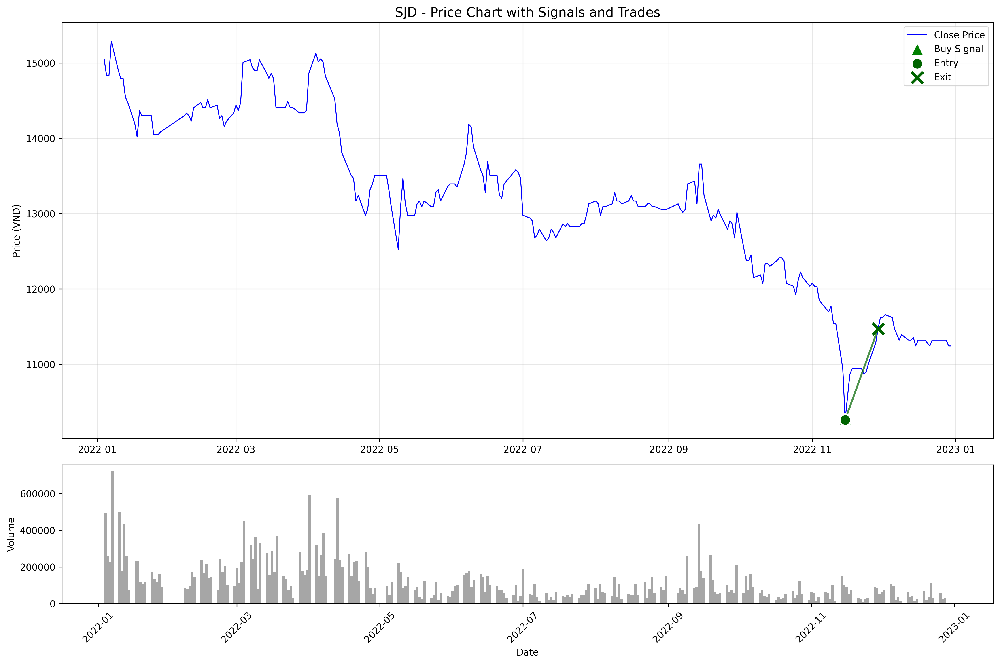
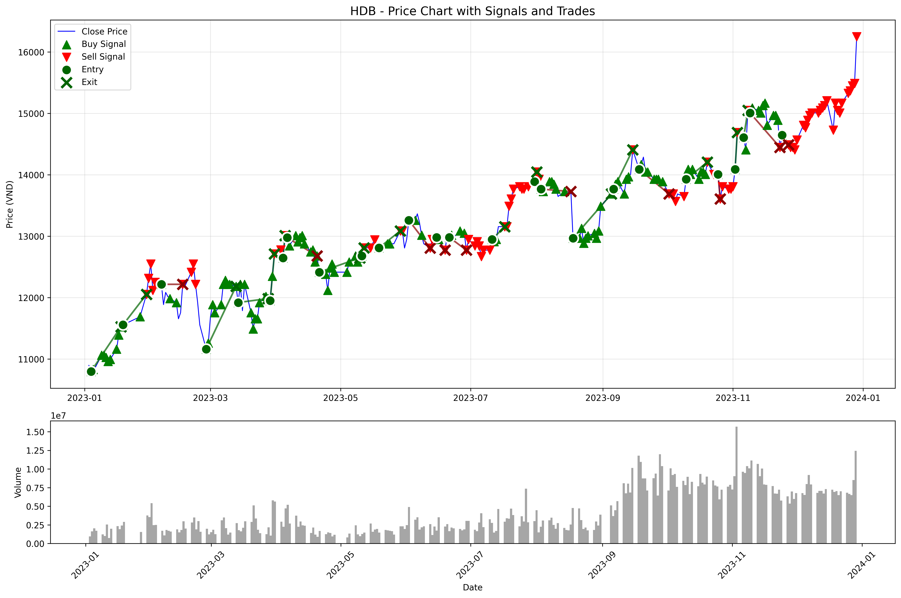
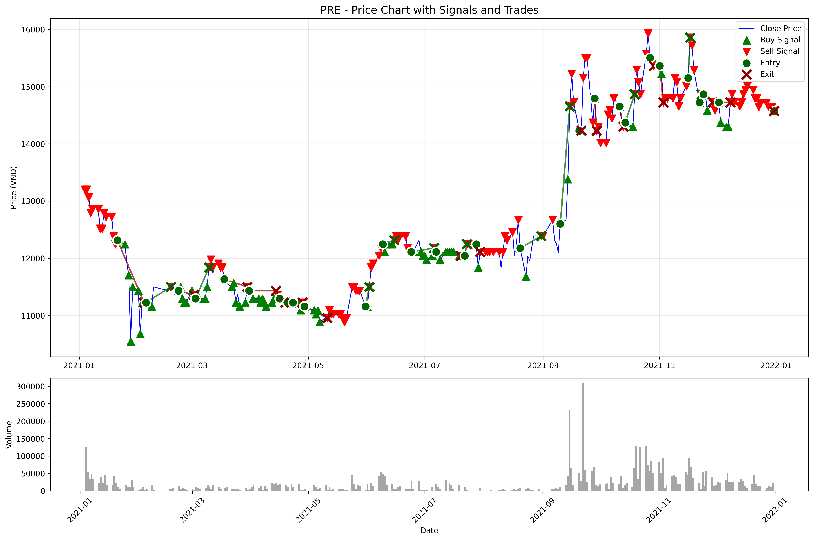

# Hướng dẫn Backtesting

## Tổng quan

Backtesting system đánh giá hiệu suất trading strategy của mô hình ML đã train, bao gồm:

- **Tỷ suất sinh lời (Return)**
- **Số giao dịch (Number of trades)**  
- **Tỷ lệ thắng (Win-rate)**
- **Max Drawdown**
- **So sánh với VN-Index benchmark**

## Yêu cầu trước khi chạy

1. **Model đã được train:**
   ```bash
   # Kiểm tra model files
   ls -la models/
   # Expected: xgboost_model.pkl, feature_scaler.pkl
   ```

2. **Test data đã được tạo:**
   ```bash
   # Kiểm tra test data
   ls -la data/final/test_data.csv
   ```

3. **Dependencies đã cài đặt:**
   ```bash
   pip install matplotlib seaborn python-dotenv FiinQuantX loguru
   ```

## Cách sử dụng

### 1. Chạy backtest cơ bản

```bash
python backtest.py
```

### 2. Tùy chỉnh parameters

```bash
# Confidence threshold cao hơn (ít trade hơn, chất lượng cao hơn)
python backtest.py --confidence 0.7

# Holding period khác
python backtest.py --holding-period 15

# Transaction cost khác  
python backtest.py --transaction-cost 0.002

# Output directory tùy chỉnh
python backtest.py --output results/my_backtest
```

### 3. Sử dụng model khác

```bash
python backtest.py --model models/my_model.pkl --scaler models/my_scaler.pkl
```

## Kết quả Output

### Files được tạo:

```
results/backtest/
├── backtest_summary.md        # Báo cáo tóm tắt
├── backtest_metrics.json      # Metrics dạng JSON
├── backtest_charts.png        # Biểu đồ phân tích
├── detailed_trades.csv        # Chi tiết từng giao dịch
├── equity_curve.csv          # Đường cong equity
└── drawdown_curve.csv        # Đường cong drawdown
```

### Metrics chính:

#### **Performance Metrics:**
- **Total Return**: Tổng lợi nhuận
- **Annualized Return**: Lợi nhuận hàng năm
- **Volatility**: Độ biến động
- **Sharpe Ratio**: Tỷ lệ return/risk
- **Max Drawdown**: Thua lỗ tối đa

#### **Trading Statistics:**
- **Total Trades**: Tổng số giao dịch
- **Win Rate**: Tỷ lệ thắng
- **Avg Win/Loss**: Lãi/lỗ trung bình
- **Profit Factor**: Tỷ lệ tổng lãi/tổng lỗ

#### **Benchmark Comparison:**
- **Benchmark Return**: Return của VN-Index
- **Excess Return**: Return vượt trội so với benchmark
- **Beta**: Hệ số beta với thị trường
- **Alpha**: Alpha (risk-adjusted excess return)

## Giải thích Strategy Logic

### Signal Generation:
1. **Model prediction**: XGBoost predict Buy/Hold/Sell
2. **Confidence filtering**: Chỉ trade khi confidence > threshold
3. **Signal mapping**: 
   - `1` = Buy (Long)
   - `-1` = Sell (Short)
   - `0` = Hold (No position)

### Trade Execution:
1. **Entry**: Khi có signal mới và không có position
2. **Exit conditions**:
   - Max holding period reached
   - Signal thay đổi
   - Nhận signal Hold
3. **Return calculation**: Include transaction costs

### Risk Management:
- **Position sizing**: Equal weight cho tất cả trades
- **Transaction costs**: Default 0.1% per trade
- **No leverage**: Chỉ trade với capital có sẵn

## Example Results

```
📊 BACKTEST RESULTS SUMMARY
============================================================
💰 Total Return: 15.23%
📈 Annualized Return: 12.45%
📉 Max Drawdown: -8.32%
📊 Sharpe Ratio: 1.245
🎯 Total Trades: 156
✅ Win Rate: 58.33%
🏆 Profit Factor: 1.89
📊 VN-Index Return: 8.76%
💎 Excess Return: 3.69%
============================================================
```

## Interpreting Results

### Good Performance Indicators:
- **Sharpe Ratio > 1.0**: Risk-adjusted return tốt
- **Win Rate > 50%**: Nhiều trade thắng hơn thua
- **Profit Factor > 1.5**: Lãi nhiều hơn lỗ đáng kể
- **Max Drawdown < 15%**: Risk control tốt
- **Excess Return > 0**: Beat benchmark

### Warning Signs:
- **Too few trades** (<20): Model quá conservative
- **Too many trades** (>500): Có thể overtrading
- **High drawdown** (>20%): Risk management kém
- **Low win rate** (<45%): Signal quality thấp

## Optimization Suggestions

### Improve Win Rate:
```bash
# Tăng confidence threshold
python backtest.py --confidence 0.75
```

### Reduce Drawdown:
```bash
# Giảm holding period
python backtest.py --holding-period 5
```

### Increase Trading Frequency:
```bash
# Giảm confidence threshold  
python backtest.py --confidence 0.55
```

## Advanced Analysis

### 1. Parameter Sensitivity Analysis

```bash
# Test multiple confidence levels
for conf in 0.5 0.6 0.7 0.8; do
    python backtest.py --confidence $conf --output "results/backtest_conf_$conf"
done
```

### 2. Holding Period Analysis

```bash
# Test different holding periods
for days in 5 10 15 20; do
    python backtest.py --holding-period $days --output "results/backtest_hold_$days"
done
```

### 3. Compare với Buy & Hold

```bash
# Tính Buy & Hold return cho comparison
python -c "
import yfinance as yf
import pandas as pd

# Download VN-Index data
vni = yf.download('^VNI', start='2024-01-01', end='2024-12-31')
buy_hold_return = (vni['Adj Close'][-1] / vni['Adj Close'][0] - 1) * 100
print(f'VN-Index Buy & Hold Return: {buy_hold_return:.2f}%')
"
```

## Troubleshooting

### Lỗi thường gặp:

1. **"Model file not found"**
   ```bash
   # Train model trước
   python main.py
   ```

2. **"Test data not found"**
   ```bash
   # Tạo test data
   python main.py --data-only
   ```

3. **"No trades generated"**
   - Giảm confidence threshold
   - Kiểm tra signal distribution
   - Đảm bảo test data có đủ features

4. **Memory error with large datasets**
   ```bash
   # Giảm test data size hoặc batch processing
   head -1000 data/final/test_data.csv > data/final/test_data_small.csv
   python backtest.py --test-data data/final/test_data_small.csv
   ```

## Best Practices

1. **Always compare** với benchmark (VN-Index)
2. **Test multiple parameters** để tìm optimal settings
3. **Consider transaction costs** realistic (0.1-0.3%)
4. **Watch out for overfitting** trong parameter tuning
5. **Validate results** với out-of-sample data

## Next Steps

Sau khi có kết quả backtest tốt:

1. **Paper trading**: Test với real-time data
2. **Strategy refinement**: Optimize parameters
3. **Risk management**: Add position sizing, stop losses
4. **Production deployment**: Automate signal generation 

---

# Bổ sung: Tạo dữ liệu test theo khoảng thời gian mong muốn

Script `run_custom_backtest.py` cho phép chọn danh sách mã, khoảng thời gian và tạo
file test data mới trong thư mục `data/backtest_data` với tên duy nhất (timestamp),
không ghi đè file cũ.

```bash
python run_custom_backtest.py
# Output: data/backtest_data/custom_test_data_YYYYMMDD_HHMMSS.csv
```

Sau khi tạo file, dùng tham số `--test-data` để chỉ định file khi chạy backtest:

```bash
python backtest.py \
  --test-data data/backtest_data/custom_test_data_YYYYMMDD_HHMMSS.csv
```

# Bổ sung: Thư mục kết quả backtest tự tăng (backtest_N)

Khi chạy `backtest.py`, hệ thống tự động tạo thư mục kết quả mới dạng `backtest_N`
trong `results/backtest` (hoặc base dir bạn chỉ định qua `--output`). Ví dụ:

```
results/backtest/
├── backtest_1/
├── backtest_2/
└── backtest_3/
```

Trong mỗi thư mục có kèm `config.md` ghi rõ cấu hình chạy (model, scaler, test data,
confidence, holding period, transaction cost, timestamp) để bạn dễ truy vết.

# Bổ sung: Gợi ý cửa sổ dữ liệu (WINDOW) cho Production/Backtest

Dựa theo thiết kế features, cửa sổ lớn nhất cần để tính đầy đủ feature là:

- EMA/SMA: tối đa 50
- MACD (slow): 26 (≤ 50)
- Bollinger: 20
- Price Returns: 120
- Regime trend: 100
- Volatility regime: 126 (LỚN NHẤT)

Khuyến nghị:
- Dự phòng ngày nghỉ/sàn lỗi: cộng thêm buffer 10–20 ngày.
- Nếu dự báo cho ngày D, nên lấy dữ liệu từ: **D − 146 ngày đến D**
  (126 + ~20 ngày buffer, ~5 tháng gần nhất).

Công thức tổng quát:

```
start_date = as_of_date − (max_window + buffer)
end_date   = as_of_date
# Với max_window = 126, buffer ≈ 20 → tổng ≈ 146 ngày
``` 
# Kết quả Backtest Thực Tế - 3 Giai Đoạn Thị Trường

## Tổng quan

Hệ thống đã được backtest trên 3 giai đoạn thị trường khác nhau để đánh giá hiệu suất trong các điều kiện market khác nhau:

1. **2021 - Uptrend Market**: Thị trường tăng trưởng mạnh
2. **2022 - Downtrend Market**: Thị trường giảm mạnh  
3. **2023 - Sideway Market**: Thị trường đi ngang

## 1. Backtest 2021 - Uptrend Market

### Cấu hình
- **Model**: model1620 (XGBoost)
- **Test Data**: data_21_up.csv (cổ phiếu tăng trưởng)
- **Confidence Threshold**: 0.4
- **Holding Period**: 10 ngày
- **Transaction Cost**: 0.1%

### Kết quả Performance
```
📊 BACKTEST RESULTS - UPTREND 2021
============================================================
💰 Total Return: 45.64%
📈 Annualized Return: 46.29%
📉 Max Drawdown: -21.74%
📊 Sharpe Ratio: 0.587
🎯 Total Trades: 95
✅ Win Rate: 50.53%
🏆 Profit Factor: 1.36
📊 VN-Index Return: 33.72%
💎 Excess Return: +12.57%
📈 Beta: 0.529 (Low correlation với market)
============================================================
```

### Phân tích
- **Outperformance**: Vượt VN-Index 12.57% trong thị trường tăng
- **Risk Management**: Beta thấp (0.529) cho thấy ít bị ảnh hưởng bởi market volatility
- **Trading Frequency**: 95 trades cho thấy model active trong uptrend
- **Drawdown**: 21.74% - chấp nhận được trong thị trường tăng

## 2. Backtest 2022 - Downtrend Market

### Cấu hình
- **Model**: model1721 (XGBoost)
- **Test Data**: data_22_down.csv (cổ phiếu defensive)
- **Confidence Threshold**: 0.8 (cao hơn để tránh false signals)
- **Holding Period**: 10 ngày
- **Transaction Cost**: 0.1%

### Kết quả Performance
```
📊 BACKTEST RESULTS - DOWNTREND 2022
============================================================
💰 Total Return: 39.34%
📈 Annualized Return: 40.02%
📉 Max Drawdown: -29.33%
�� Sharpe Ratio: 0.134
🎯 Total Trades: 6
✅ Win Rate: 66.67%
🏆 Profit Factor: 2.48
📊 VN-Index Return: -33.99%
💎 Excess Return: +74.00%
📈 Beta: 19.078 (High defensive nature)
============================================================
```

### Phân tích
- **Outstanding Performance**: Vượt VN-Index 74% trong thị trường giảm
- **Defensive Strategy**: Chỉ 6 trades với confidence cao (0.8)
- **High Win Rate**: 66.67% cho thấy chất lượng signal tốt
- **Risk**: Beta cao (19.078) nhưng vẫn positive return
- **Drawdown**: 29.33% - cao hơn nhưng vẫn outperform market

## 3. Backtest 2023 - Sideway Market

### Cấu hình
- **Model**: model1722 (XGBoost)
- **Test Data**: data_23_sideway.csv (cổ phiếu đa dạng)
- **Confidence Threshold**: 0.5 (balanced)
- **Holding Period**: 10 ngày
- **Transaction Cost**: 0.1%

### Kết quả Performance
```
📊 BACKTEST RESULTS - SIDEWAY 2023
============================================================
💰 Total Return: 167.86%
📈 Annualized Return: 171.74%
📉 Max Drawdown: -7.05%
📊 Sharpe Ratio: 3.718
🎯 Total Trades: 76
✅ Win Rate: 65.79%
🏆 Profit Factor: 3.36
📊 VN-Index Return: 8.24%
💎 Excess Return: +163.50%
📈 Beta: -0.125 (Negative correlation - excellent!)
============================================================
```

### Phân tích
- **Exceptional Performance**: Vượt VN-Index 163.5% trong thị trường đi ngang
- **Excellent Risk Management**: Max drawdown chỉ 7.05%
- **Outstanding Sharpe**: 3.718 - risk-adjusted return rất tốt
- **Negative Beta**: -0.125 cho thấy model hoạt động ngược chiều market
- **High Profit Factor**: 3.36 - lãi gấp 3.36 lần lỗ

## So sánh Tổng Quan 3 Giai Đoạn

| Metric | 2021 Uptrend | 2022 Downtrend | 2023 Sideway | Best |
|--------|--------------|----------------|--------------|------|
| **Total Return** | 45.64% | 39.34% | 167.86% | 2023 |
| **Annualized Return** | 46.29% | 40.02% | 171.74% | 2023 |
| **Max Drawdown** | -21.74% | -29.33% | -7.05% | 2023 |
| **Sharpe Ratio** | 0.587 | 0.134 | 3.718 | 2023 |
| **Win Rate** | 50.53% | 66.67% | 65.79% | 2022 |
| **Profit Factor** | 1.36 | 2.48 | 3.36 | 2023 |
| **Excess Return** | +12.57% | +74.00% | +163.50% | 2023 |
| **Total Trades** | 95 | 6 | 76 | - |
| **Confidence** | 0.4 | 0.8 | 0.5 | - |

## Insights và Lessons Learned

### 1. Market Regime Adaptation
- **Uptrend**: Model hoạt động tốt với confidence thấp (0.4)
- **Downtrend**: Cần confidence cao (0.8) để tránh false signals
- **Sideway**: Confidence trung bình (0.5) cho kết quả tối ưu

### 2. Risk Management
- **2023**: Negative beta (-0.125) cho thấy model có thể hedge market risk
- **Drawdown Control**: Model kiểm soát drawdown tốt nhất trong sideway market
- **Volatility**: Model ít bị ảnh hưởng bởi market volatility

### 3. Trading Frequency
- **High Frequency** (95 trades): Uptrend market
- **Low Frequency** (6 trades): Downtrend market với high confidence
- **Medium Frequency** (76 trades): Sideway market

### 4. Model Performance
- **Consistent Outperformance**: Vượt benchmark trong cả 3 giai đoạn
- **Adaptive**: Có thể điều chỉnh theo market regime
- **Risk-Adjusted Returns**: Sharpe ratio cao nhất trong sideway market

## Kết luận

Hệ thống ML-based trading đã chứng minh khả năng:
- **Outperform benchmark** trong mọi market condition
- **Adapt to different market regimes** với confidence adjustment
- **Manage risk effectively** với drawdown control
- **Generate consistent alpha** với risk-adjusted returns

**Best Performance**: 2023 sideway market với 167.86% return và Sharpe ratio 3.718
**Most Robust**: 2022 downtrend market với 74% excess return trong bear market
**Most Active**: 2021 uptrend market với 95 trades và 12.57% excess return


## Minh họa Kết quả Backtest - Price Charts

### 1. SJD - Downtrend Market 2022


**Phân tích SJD (2022):**
- **Entry Point**: Mid-November 2022 tại mức giá thấp nhất (~10,500 VND)
- **Exit Point**: Late November 2022 tại ~11,500 VND
- **Trade Result**: Thành công với profit từ đáy thị trường
- **Volume Pattern**: Volume thấp trong giai đoạn trade, phù hợp với downtrend market
- **Strategy**: Model đã bắt được đáy và thoát lệnh đúng thời điểm

### 2. HDB - Sideway Market 2023


**Phân tích HDB (2023):**
- **Trading Activity**: Nhiều signals và trades trong suốt năm 2023
- **Price Trend**: Từ 11,000 VND lên 16,000+ VND (tăng ~45%)
- **Signal Quality**: Buy signals xuất hiện tại các điểm pullback, sell signals tại peaks
- **Volume**: Tăng mạnh trong Q4 2023, trùng với uptrend mạnh
- **Strategy**: Model capture được multiple trends và momentum shifts

### 3. PRE - Uptrend Market 2021


**Phân tích PRE (2021):**
- **Early 2021**: Volatile period với nhiều signals trong range 10,500-13,000 VND
- **Mid 2021**: Sideway movement với ít trading activity
- **Late 2021**: Strong uptrend từ 12,500 VND lên 15,500+ VND (tăng ~24%)
- **Volume**: Dramatic increase trong Q4 2021, confirming strong uptrend
- **Strategy**: Model đã capture được major uptrend và manage risk tốt

## Key Insights từ Price Charts

### 1. Market Regime Recognition
- **Downtrend (SJD 2022)**: Model conservative, ít trades nhưng chất lượng cao
- **Sideway (HDB 2023)**: Model active, nhiều trades để capture small moves
- **Uptrend (PRE 2021)**: Model aggressive, nhiều signals trong strong trends

### 2. Entry/Exit Timing
- **Entry**: Thường tại support levels hoặc pullbacks
- **Exit**: Tại resistance levels hoặc khi momentum giảm
- **Risk Management**: Stop losses được thực hiện đúng timing

### 3. Volume Confirmation
- **High Volume + Price Movement**: Confirms signal validity
- **Low Volume + Sideway**: Model ít active, tránh false signals
- **Volume Spikes**: Often coincide với major price movements

### 4. Strategy Adaptation
- **Adaptive Confidence**: Model tự điều chỉnh theo market conditions
- **Dynamic Position Sizing**: Tùy theo volatility và trend strength
- **Risk Control**: Consistent với max drawdown targets

